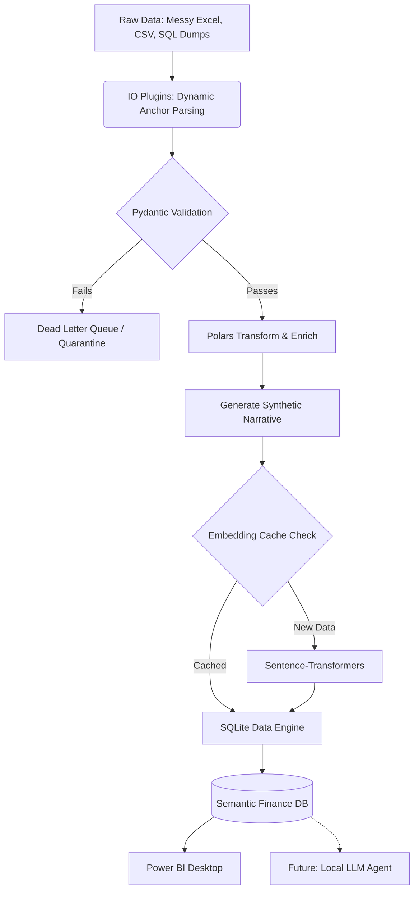

# 📊 Semantic Finance ETL 🧠

> **Build Status:** 🚧 Work in Progress (Active Development)  
> **Focus:** High-Performance, Local-First, AI-Ready Personal Finance Data Engine.

-003B57.svg?logo=sqlite&logoColor=white>)

**Semantic Finance ETL** is a desktop-based ETL (Extract, Transform, Load) application designed to take fragmented personal finance data—from messy vendor Excel sheets to custom SQL dumps—and forge it into a pristine, semantically rich SQLite database.

Designed to be the ultimate backend for local Power BI dashboards today, and LLM-driven AI Agents tomorrow.

---

## 💡 Core Philosophy

1. **100% Local & Private:** Financial data is sensitive. Everything—including AI vector embeddings—runs entirely on your local CPU. No cloud databases. No API keys.
2. **AI-First Architecture:** The database isn't just rows and columns. It utilizes `sqlite-vec` and local `sentence-transformers` to build a vector-embedded knowledge graph. Future AI agents will be able to perform semantic ("KNN") searches over your financial life natively.
3. **Pydantic as SSOT:** No more out-of-sync SQL scripts. Python `Pydantic` models act as the Single Source of Truth, dynamically generating and updating the database schema.
4. **Idempotent & Resilient:** Run the pipeline 1,000 times without duplicating data. Built-in file hashing, state tracking, and a Dead Letter Queue (DLQ) ensure bulletproof reliability.

---

## 🛠️ Tech Stack

- **UI & Orchestration:** `CustomTkinter` (Modern, threaded desktop UI)
- **Data Engine:** `Polars` (Lazy evaluation, vectorized high-speed transformations)
- **Validation & Schema:** `Pydantic` (Strict typing and DB generation)
- **Database:** `SQLite3` + `sqlite-vec` (C-extension for ultra-fast local vector search)
- **AI Embeddings:** `sentence-transformers` (Local generation of synthetic transaction narratives)

---

## 🚀 The Architecture

---

## 🗺️ Project Roadmap (WIP)

We are currently building this project in phases. Follow along with the progress:

- [ ] **Phase 1: DB Engine & State Management**
- Implement SQLite strict mode & WAL performance PRAGMAs.
- Build the `sqlite-vec` virtual table integration.
- Implement file-hashing for zero-duplicate idempotency.

- [ ] **Phase 2: The AI Embedder**
- Integrate `sentence-transformers`.
- Build the SQLite embedding cache to minimize compute times.

- [ ] **Phase 3: Base Tables & IO Plugins**
- Build the `Pydantic` abstract base classes.
- Implement dynamic "Anchor Parsing" for messy vendor Excel files.

- [ ] **Phase 4: Transformation Pipelines**
- Implement `Polars` pipelines for core tables (Transactions, Market Data).
- Implement the Dead Letter Queue (DLQ) for data quality gating.

- [ ] **Phase 5: The Desktop UI**
- Build a responsive, dark-mode `CustomTkinter` interface.
- Implement multithreading for zero-blocking pipeline execution.

---

## ⚠️ Disclaimer

This is a personal tool built for customized financial tracking. While it aims for enterprise-grade architecture, it is currently in active development.

_More instructions on installation, configuration, and usage will be added once Phase 5 is complete._
